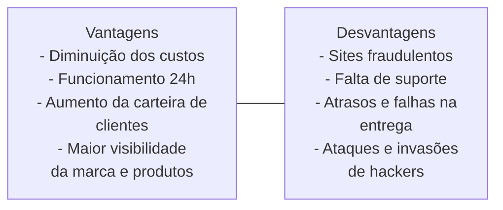

# Empreededorismo
Pode ser considerado umas das estratégias mais importantes para fortalecer a economia global. Sendo responsável pela maior parte do PIB de muitos países, os micro e pequenos negócios ainda empregam a maior parcela da população.  
A geração da ideia de oportunidades de negócios são essenciais.
# MEI
o registro do CNPJ MEI, que passou a vigorar com a li de 2008, visa formalizar o pequeno empresário individual que se arrisca a abrir um negócio por necessidade, sem ter visão de futuro, e obriga o pequeno empreendedor a pensar em questões mais burocráticas e de ordem de planejamento.  

# Tipos de empreendedores no Brasil
- Informal: Empreendedor por necessidade.  
- Individual: Informal que se formalizou através do MEI  
- Cooperado: Ligado às cooperativas  
- Social: Aquele com objetivo social  
- Corporativo: Intraempreendedor  
- Público: Combinação de corporativo e setor governamental.  
- Franquado e franqueador: Investidores de franquias.  
- Do conhecimento: Profundo conhecedor de uma área que está em falta no mercado.  
- Negócio próprio: Detentor de iniciativa própria: uma pessoa visionária.

# Empreendedorismo digital
Pode ser definido como ações empreendedoras para desenvolver empresas ou novos negócios que têm suas operações inteiramente ou parcialmente estabelecidas em plataformas na internet, por exemplo nas questões de marketing e vendas.  
## E-business e e-commerce
- E-business: Corresponde a todos os processos oranizacionais das empresas que podem ser geridos por sistemas empresariais que estejam alicerçados na internet para consulta ou operações a qualquer hora, momento ou lugar.  
- E-commerce: É o próprio processo de compra e vendas pela internet. É uma parte do e-business, que diz sobre as transações e operações de compra e venda.  
Alguns dos motivos que fazem o numero de consumidores a comprarem pela internet, aumentar:  
- Mais dispositivos móveis conectados a rede.  
- Novas aplicabilidades das redes sociais.  
- Negocições dinâmicas e comunicação interativa.  
- Preços mais acessíveis e aumento da segurança
## Processo empreendedor
É um conjunto estruturado de medidas que devem ser tomadas de modo ordenado pelo empreendedor logo após o surgimento da ideia ou reconhecimento da oportunidade de negócio, proporcionando maior assertividade na tomada de decisão empreendedora, aumentando consideravelmente as chances de sucesso.  
O processo empreendedor se inicia quando há um **evento gerador ou catalizador** que acelera algumas variáveis, por exemplo:  
- Inovação  
- Realização profissional  
- Desafios de carreira
  
## Decisão de empreender
Pode ser decorrente de vários fatores:  
- Aspectos sociais  
- Aspectos ambientais  
- Oportunidades de mercado  
- Interesses profissionais  

## Tecnologias da informação e comunicação
As Tecnologias da Informação e Comunicação (**TICs**) tem sido fundamentais para uma maior interatividade e proximidade entre pessoas, clientes, fornecedores entre outros.

## Desafios do e-empreendedor
- Gestão das informações  
- Tempo de entrega  
- Segurança no pagamento  
Entre as vantagens e desvantagens, temos:  

# Oportunidades empreendedoras
Ideias são como bebês, nascem pequenas e imaturas.
## Insight
Quando acessamos a internet e temos contato com informações, reportagens, descobertas etc, tudo isso pode nos levar a um insight e resultar em uma invenção.
## Inovação X Invenção
Inovação: Evolução e desenvolvimento contínuo de produtos e serviços com o aproveitamento das oportunidades do ambiente externo para fins comerciais.  
Invenção: Criação de um novo produto, serviço ou processo sem necessariamente apresentar um propósito e/ou uma finalidade comercial.  
