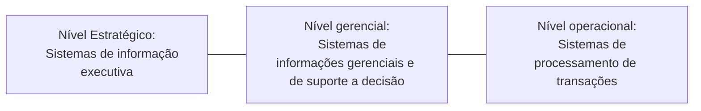

# Diferença: Dados, Informação, Conhecimento, Competência
**Dados:** Sequência de símbolos, caracteres, não "úteis" até seu processamento. Ainda não tem significado.  
**Informação:** Dados que foram processados para serem úteis. Fornece respostas pra questões como: Quem, o que, onde. Dados que receberam um significado.  
**Conhecimento:** É  aplicação das informações. Quando "memoriza" as informações, então se é acumulado o conhecimento.  
**Inteligência:** É um processo analítico, aonde se sintetiza novos conhecimentos a partir de conhecimentos previamente armazenados.  
**Sabedoria:** Capacidade de utilizar corretamente a compreensão disponível sobre determinado assunto, aumentando a eficácia em fazer as coisas da maneira correta. Enquanto a inteligência é a habilidade de aumentar a eficiência, aqui além disso temos também os outros niveis de consciência (moral, códigos etc).  
As primeiras categorias, se referem ao passado e presente, pois lidam com o que foi ou é conhecido. Enquanto a categoria sabedoria lida com o futuro pois incorpora visão.  
**Competência:** Associada à realização de uma tarefa no mundo em que vivemos, aonde é exigido tanto o conhecimento quanto a habilidade.

## Competência
Composta por 3 dimensões:
- Habilidade: Técnica, capacidade, saber como;  
- Conhecimento: Informação, Saber o quê e porquê;  
- Atitudes: Quero fazer, determinação.  
# Organizações de Informação intensiva X Conhecimento intensivo
**Informação intensiva:** Voltadas à informação, por exemplo empresas de comunicação, mídia, instituições de ensino que não estão focadas em pesquisas.  
**Conhecimento Intensivo:** Aquelas que ao mesmo tempo que gerem elas também aprimoram seu capital intelectual para prestar melhor serviço, exemplo empresas de consultoria computacional, centro de pesquisa.  

# Trabalhadores de conhecimento e informação
**Conhecimento:** Pesquisadores, Analistas financeiros etc.  
**Informação:** Professores, enfermeiros, operadores de call center etc.  

# Dimensões da qualidade da informação
É algo subjetivo, ou seja, não é exato. Pois depende do contexto em que está inserida e das interpretações.  
Existem 2 entendimentos sobre a qualidade da informação:  
- A informação como algo que é desenvolvido e obtido, tendo sua natureza direcionada para o objetivo.  
- A informação vinculada às pessoas que à detêm, com natureza implícita voltada aos aspectos subjetivos da informação.  
## Níveis de classificação de dimensões
**Abrangência da informação:** Quantidade de informação no tamanho certo e de modo satisfatório de acordo com as necessidades. *Atributos: vetores da informação.*  
**Integridade da informação:** Quando uma informação sofre qualquer alteração ou atualização nao autorizada ela é uma informação não íntegra. *Atributos: nivel de integridade da informação*.  
**Acurácia da informação:** Trata-se da informação legítima e válida, uma vez que o nivel de acurácia da informação depende dos procedimentos que são empregados para sua geração. *Atributos: nível de acurácia; método para determinar o nível ede acurácia.*  
**Confidencialidade da informação:** O manuseio da informação durante o processo de gestão do conhecimento faz com que a confidencialidade de informações sobre pessoas, processos e outros seja crítica. *Atributos: público-alvo, predileções informacionais do público alvo.*  
**Atualidade da informação:** Com o decorrer do tempo as informações tendem a se desatualizar ou se desvincular da realidade atual. Portanto para aumentar a qualidade da informação é necessário atualizações. *Atributos: data de geração da informação; horário de geração da informação; intervalo de tempo entre cada nova geração da informação.*  
**Ineditismo da informação:** Pode ser entendido como raridade da informação. Ultrapassando o conceito de novidade. Exemplo; as informação de culturas nativas sorbe o uso de plantas medicinais, são raras e contruídas ao longo de vários séculos. *Disponibilidade de informações idênticas ou similares.*  
**Contextualização da informação:** É composta por itens que bucam atrair e manter a atenção do público-alvo, como o idioma utilizado, teor do texto etc, O objetivo é fazer com que a informação esteja contextualizada com os interesses e realidades do público-alvo. *Atributos: caracterização da informação.*  
**Precisão da informação:** Detalhamento necessário para o pronto usod a informação, por meio da seleção adequada de imagens, palavras etc. *Atributos: nível de precisão da informação.*  
**Confiabilidade da informação:** Aquele em que os usuários acreditam independente de ser verídica. Esta associada a credibilidade do autor/fonte. *Atributos: credibilidade da onte; credibilidade do conteúdo.*  
**Originalidade da informação:** Se é traduzida, copiada, editava, se teve alguma alteração no conteúdo original. *Atributos: originalidade da informação.*  
**Existência da informação:** *Atributos: localização do algoritmo para geração da informação;*  
**Pertinência da informação:** Mensura a capacidade da informação de agregar valor ao púbico-alvo. *Atributos: valor potencial da informação; valor entregue pela informação.*  
**Identidade da informação:** Relacionada ao nome atríbuido, o qeu interfere no proceso de busca e acesso. *Atributos: Nome; sinônimos, autoria*  
**Audiência da informação:** Analisa o acesso à informação pelo seu público-alvo de modo que as informações podem ter seus acessos monitorados para a tomada de decisões. *Atributos: frequência de acesso, duração do tempo de acesso.*  

# Introdução aos sistemas de informação
Os profissionais de TI passam suas carreiras projetando, desenvolvendo, implementando, atualizando, administrando e empregando sistemas todos os dias.  
O objetivo de um sistema de TI é permitir que as organizações processem e compartilhem informações. Já os resultados de um sistema de TI bem-sucedido são documentos, processos de negócios produtividade aprimorados.  
O sistema de informações baseado em computador é compostod e vários elementos diferentes:
- **Dados:** Os dados são a representação fundamental de fatos e observações. Os dados são processados por um sistema de computador para fornecer as informações que justificam a existência do computador.  
- **Hardware:** Processa os dados executando instruções, armazenando dados e movendo dados e informações entre os diversos dispositivos de entrada e saída que tornam o sistema e as informações acessíveis aos usuários.  
- **Software:** Consiste no sistema e nos programas que definem as instruções executadas pelo hardware. O software determina o trabalho a ser realizado e controla a operação do sistema.  
- **Comunicação:** Os modernos sistemas de informação computacionais dependem da capacidade de compartilhar operações e dados de processamento entre diferentes computadores e usuários, localizados locamente ou remotamente. A comunicação de dados fornece esse recurso.  

Lembrando que as pessoas envolvidas com os sistemas de informação são elementos essenciais no funcionamento do sistema.  
Ao analisar um sistema, os próprios componentes podem ser representados como sistemas. O nível de de detalhe a ser considerado depende do contexto em que o sistema está sendo desenvolvido ou avaliado. A divisão de um sistema ou subsistema em seus componentes é chamada de decomposição.  

## Categorias princiapais de sistemas de informações
Elas são classificadas de acordo com o nível em que a tomada de decisão ocorre:
