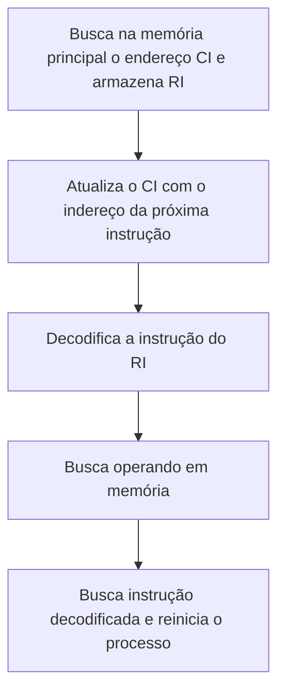
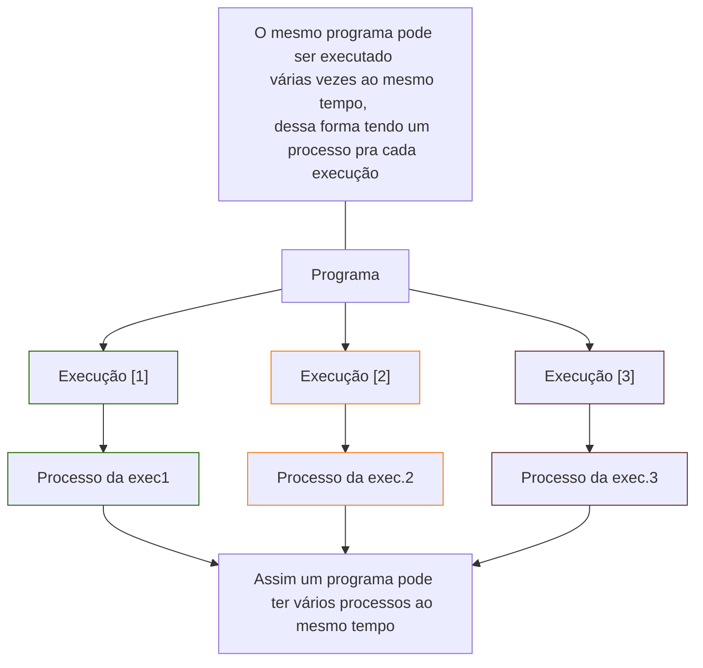
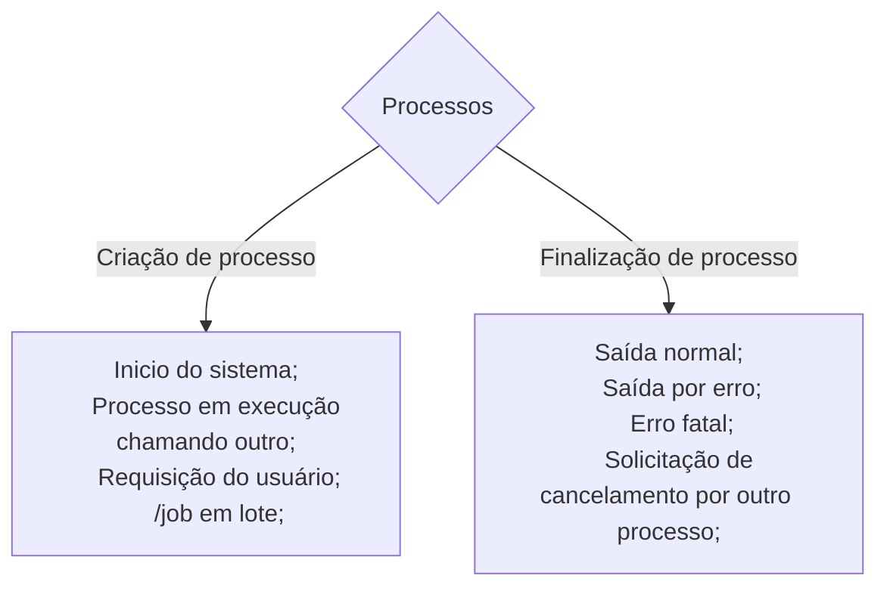
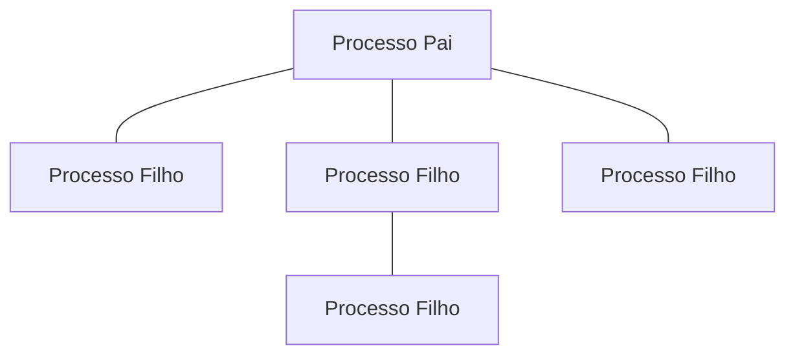

# O que é sistema operacional?
Sempre vai ser algo intermediário entre o software e o hardware.  
O sistema operacional gerencia o Hardware e o Software, ele faz uma interação entre o usuário e o Hardware, nós não controlamos o Hardware, nós executamos algumas ações, ocorre uma verificação e o sistema operacional assume o controle. Se não existisse o sistema operacional, não conseguiriamos fazer certas ações, como acessar a internet por exemplo.  
Segundo Tanenbaum, as funções do S.O são:  
- Estender a máquina (ou máquina virtual): A função do S.O  como uma máquina estendida/virtual é de esconder do programador a complexidade do hardware, apresentando uma interface amigável.  
- Gerenciar os recursos: O sistema operacional controla de forma ordenad e compartilhada os recusos do computador.  
Cabe ao sistema operacional servir de interface entre os usuários e os recursos disponpiveis no sistema computacinal.
- Por exemplo, quando queremos imprimir:  
    1- Clico em um botão, através de uma aplicação;  
    2- Essa aplicação vai chamar meu sistema operacional;  
    3- O sistema operacional vai se comunicar com o meu Hardware, nesse caso o Hardware é a impressora, ele vai localizar, ver o status da impressora etc  
- Lembrando que as máquinas só processam informações na linguem binária.
O  sistema operacional funciona através de camadas, então temos a seguinte forma:

    | estrutura |
    |-----------|
    |Aplicações|
    |Utilitários|
    |Sistema Operacional|
    |Linguagem de máquina|
    |Microprogramação|
    |Circuitos eletrônicos|

Resumindo: O usuário interage com as **Aplicações**. Essas aplicações interagem com os **utilitários**, e e esses interagem com o **sistema operacional** e esse transforma o nosso pedido em **linguagem de maquina** (*linguagem binária*)e essa trabalha com a **microprogramção** que vai acionar os **circuitos eletrônicos**  
#### Então, qual as principais funções do sistema operacional?
- Oferecer meios para que um programa seja carregado em memória e executado.  
- Um sistema de arquivos, permitindo criar, ler, escrever e excluir arquivos.  
- Uma interface de acesso aos periféricos.  
- Mecanismos de monitoração de recurso, capazes de identificar os possíveis gargalos no sistema.  
- Meios para armazenar/manter o estado do sistema.

### Kernel
O núcleo do sistema se chama Kernel. Esse é composto por um processador, memória, sistema de arquivos, além de gerenciar os dispositivos de entrada e saída. Ele quem faz o gerenciamento dos recursos do computador. As principais funções desse núcleo são:  
- Tratamento de interrupções  
- Gerenciamento, sincronização, comunicação e escalonamento de proecessos e threads  
- Gerenciamento da memória  
- Gerenciamento dos sistemas de Arquivos  
- Gerenciamento dos dispositivos de E/S  
- Auditoria e segurança do sistema  
Os modos de acesso aos serviços do núcleo podem ser realiados de duas formas,  
- Modo usuário: Programas podem executar ações sem privilégio, como a leitura de um arquivo.  
- Modo Kernel: Nesse, o acesso pode ser realizado de modo usuário E de modo com privilégio tota, como o acesso ao disco.  
Quando um programa é executado o kernel é consultado para saber se o acesso será realizado me modo usuário ou kernel.  

### Estrutura do sistema operacional
Quando falamos da estrutura do S.O estamos falando da maneira pelo qual o código do sistema é organizado e o inter-relacionamento entre seus diversos componentes pode variar conforme a concepção do projeto.  
São alguns dos seus principais modelos de arquitetura:
- **Sistemas monoliticos:** O sistema operacional é escrito como um conjunto de módulos que são compilados separadamente e depois agrupados em um arquivo executável onde cada procedimento pode ser chamado por outro quando precisar. Todas as funções em um único pacote a ser distribuido ao cliente. Módulos executados separadamente mas que compõem um único executável.
- **Sistema em camadas:** Organiza o sistema operacional como uma hierarquia de camadas. Cada camada oferece um conjunto de funções que podem ser utilizadas pelas camadas superiores.  
- **Máquinas Virtuais:** Uma máquina Virtual (VM) é similar a uma máquina real. Um nível intermediário é criado entre o sistema operacional e o hardware. Cria máquinas virtuais independentes dentro de uma mesma máquina física. Esse ,nível cria várias máquinas virtuais independetes, onde cada qual possui uma cópia virtual do hardware.  
- **Modelo Cliente-Servidor:** Nesse modelo a ideia é implementar a maior parte das funções em modo usuário. Tudo o que o kernel faz é cuidar da comunicação entre cliente e servidor. Programa do computador (**cliente**) solicita um serviço/recurso de outro programa (**servido**). Modelo que vincula dispositivos informaticos atraves de uma rede.  

### Classificação dos sistemas operacionais
Os sistemas operacionais podem ser classificados em:
|classificação|
|----------------------------|
|Monoprogramáveis/monotarefa|
|Multiprogramáveis/multitarefas|
|Sistemas com múltiplos processadores|

**Monoprogramáveis:** Referem-se aos primeiros S.O. Faziam uma tarefa por vez, enquanto não terminasse uma tarefa, ela não faria outra. Utilizava todos os recursos (processador, memória, periféricos etc) para executar uma única tarefa por vez. Um único usuário pode interagir com o sistema.  
**Multiprogramáveis:** Esse sistemas dividem os recusos com os demais programa, com isso a CPU  não fica ociosa. Podem ser classificados pela maneira em que as aplicações são gerenciadas e pelo número de usuários que utilizam o sistema, no caso *monousuarios* ou *multiusuários*. Em relação a maneira em que as aplicações são gerenciadas, podem ser classifcadas como: *sistemas batch*,*de tempo compartilhado*, e de*tempo real*.  
É permitido que mais de um usuario o utilize. Várias aplicações dividindo os mesmos recursos da máquina.  
**Múltiplos processadores:** 
Utilizam duas ou mais *UCPs* (Unidade Central de Processamento) que trabalham em conjunto. Ou seja, além da máquina poder executar vários proramas simultaneamente, agora o seu processamento pode ser dividido entre os processadores. Esse tipo de sistema pode ser subdivido em: Fortemente acoplados e Fracamente acoplados.  
    - Fortemente acoplados: 1 memória compartilhada por todos os processadores. Há vários processadores compartilhando uma única memória física, e os dispositivos de entrada e saída são gerenciados por um único sistema operacional. Por exemplo o Unix e o Windows. Existe uma memória compartilhada por todos os processadores.  
    - Fracamente acoplados: Cada sistema tem sua própria memória individual. Possuem 2 ou mais sistemas interconectados em rede, sendo que cad asistema opera de forma independente com seu próprio sistema operacional e gerenciamento de recursos de processamento (UCPs), memória e dispoitivos. Cada sistema tem sua própria memória individual

A internet é um sistema operacional de múltiplos processadores fracamente acoplado conhecido também como *Sistemas distribuídos*.

### Alguns conceitos importantes e busca de instruções do processador

**Hardware:** Os dados do processo ficam armazenados nos registradores (status, PC e SP)
**Software:** Há especificação de recursos e suas limitações para que possam ser alocados os processos. Nome, ÍD(identificaçao), Owner, prioridade, data/hora, tempo de processador etc
**Armazenamento:** Refere-se a area de memória que será alocado o processo para que possa ser executado
Eis algumas partes da arquitetura do sistema operacional:  
**Processador:** Gerencia o sistema computacional.  
**Unidade de controle (UC):** Gerencia as atividades dos componentes do computador como gravação de dados e localizar instruções.  
**Unidade lógica e Aritmética (ULA):** Realiza operações lógicas e aritméticas.  
**Registradores:** Armazena dados temporariamente. (memórias caras = memórias pequenas)  
**Controlador de instruções (CI):** Contém o endereço da próxima instrução para o processador executar.  
**Apontador da pilha (AP) ou stack pointer (SP):** Refere-se as instruções que estão no topo da pilha de execução, contém seu endereço na memória.  
**Registrador de instruções (RI):** Armazena a insrução que será decodificada pelo processador.  
**Registrador de status ou program status word (PSW):** Armazena informações sobre os processos em execução.  

**Ciclo de busca e instruções do processador:**

Eis os recursos que o sistema operacional gerencia:
**Memória principal:** Acesso pelo endereo que é registrado pelo MAR (memory address register). Através dele, a unidade de controle, saberá onde alocar os dados e sua disponiilidade.
**Memória cache:** Utilizada pra minimizar a diferença entre a velocidade do processador e da leitura dos dados na memória principal. Ela é pequena, porém muito veloz, pois armazena uma parte do conteúdo da memória principal e é acessada primeiro pelo processador. Quanto menor a cache, mais rápido será oa cesso ao dado. Primeiro o processador busca na memória cache e depois vai buscar na memória principal. É uma memória volátil, ou seja, fica armazenada por pouco tempo.
**Memória secundária:** Nao volátil, ou seja, o que gravou, ficou lá gravado. É uma memória barata.
**Dispositivos de entrada e saída:** Hardwares, viabiliza a comunicação entre o sistema computacional e o ambiente externo.
**Barramentos:** Canais que viabilizam a comunicação, as linhas de comunicação entre condutores processadores, memórias e dispositios.
**Pipelining:** Técnica que permite o processador executar várias tarefas paralelamente em estágios diferentes. Divide ua tarefa em sub-tarefas para execução em sequência. Enquanto uma função está sendo executada, ele já está buscando qual é a próxima, para assim agilizar o processamento de forma geral. 
**Arquitertura RISC e CISC:** Processadores interpretarão os dados e as instruções em uma linguagem de máquina. A RISC tem poucas instruções e são executadas diretamente pelo Hardware. A CISC possui instruções mais complexas que são itnerpretadas por miniprogramas da memória RAM.
**Software**
**Tradutor:** Traduz as instruções pra linguagem da máquina
**Interpredator:** 
**linkador**
**Loader:** Carrega na memória principal o programa a ser executado.

----------------
**Throughput:** Essa taxa refere-se a quantidade de dados que são processados e ao tempo que levou para isso acontecer. É aplicavel tanto em transferências em disco rígido quanto em redes de computadores.

### Características dos sistemas multiprogramáveis
**Interrupção:** Ela não depende de um processo em execução, e sim ocorre em função de um evento externo ao prorama que está em uso. Acontece a qualquer momento. E quando ocorre, os dados são armazenados. Ocorre em função de um evento externo ao programa que está em uso e interrompea execução normal de um programa.   
**Exceção:** É diretamente ligada ao prorama, ou seja, é um evento ocorrido em função do processamento do programa.  Refere-se a condições de erro. Ex: durante a execução de um programa é tentado acessar uma área da memória que não é permitida pra esse usuário.  
**Operações de Entrada e Saída:** O controlado ou interface, reconhece os comandos e solitações advindas dos dispositivos e que precisam se comunicar com o hardware e com o software. Assim o processador não se comunica diretamente com o hardware e com o software, e sim com o controlador ou interface. Temos 2 tipos de controladores: E/S controlada por programa e E/S controlada por interrupção  

**Vetor de interrupção:** Guarda o endereço em que está o conjunto de instruções que foram executadas para tratar o evento.
**Registrador de Status:** Armazena qual foi o tipo de evento ocorrido, pois para ada tipo a sua respectiva rotina de tratamento.

#### Sistemas operacionais embarcados: 
São usados por exemplo para computadores de mão: Celulares, aparelhos de TV, mircro-ondas.
Estes sistemas possuem caracteriscas dos sistemas operacioanais de tempo real, mas possuem limitações de memória e consumo de energia.
Ex: tvOs(Apple), WebOs(LG), Tizen(Samsung)

#### Sistemas operacionais Mobile:
São encontrados em celulares,tablets e MP3 Players. São mais simples e érmitem a comunicação de dados sem fio.
Ainda permitem a utilização de rádio, câmera, gravador de voz entre outros.
Exemplos: Android, Windows Phone, iOS, etc. 

#### Sistemas operacionais na Nuvem:
Utilizam os conceitos com base na computaçao na nuve, (os serviços como banco de dados, redes, são feitoas pela internet).
Todos os dados do usuário e aplicativos ficam na nuvem o acesso é via internet.

#### UNIX:
Sistema portavel, multitarefa  

### Diferenaças entre Windows e Linux:
#### A lincença: 
Para usar o windows é necessario adquirir a licença da Microsoft que é paga, já no Linux a licença o usuário pode aixar em quantas máquinas quiser.
#### Acesso ao código-fonte:
No windows o código-fonte é restrito apenas a seus desenvolvedores. Já o do Linux é aberto e todos os usuários tem acesso e podem modifica-los.
#### Linha de comando:
Um dos pontos fortes do Linux é a linha de comando que permite uma administralão efetiva do sistema operacional o Windows també possui linha de comando, mas não é tao efetiva, porque quase todas as confiurações são realizadas pela interface gráfica
#### Flexibilidade e riidez:
O Linux permite que o usuário adeque o sistema operacional do jeito que ele desejar em relação ao ambiente gráfico. No Windows as regras são definidas pela Microsoft
### Características e composição: Unix, Linux
#### Unix
É um sistema multiprogramável, multiusuário, suporta varios processadores e implementa memória virtual. Algumas de sus características:  
- Sua linguagem facilita a compreensão e a portabilidade para outras plataformas.  
- Pode ser usado em diversas aplicações.  
- Suporte a protocolo de rede.  
- Sistema de arquivos com estruturas simples.  
- Interface simples e uniforme com os dispositivos de entrada/saída  
  
O unix se baseia em uma estrutura monolítica, ou sea, as funções são executadas em modo núcle. Sua estrutura é composta por:  
- Kernel: Núcle  
- Shell: É o responsável pela conexão dos usuarios com os sistemas operacionais através da linha de comando.  
- Sistema de arquivos: Responsável pela organização dos dados que são armazenados no Unix.  
- Aplicações

#### Linux
Sistema operacional de código fonte aberto. O Linux em si é somente o kernel do SO, para que ele funcione são necessários por exemplo, compiladores do código fonte. Possui a mesma estrutur que o Unix. As versões do Linux são conecidas como distribuição (kernel mais programas). Alguns deles são:  
- Ubuntu  
- Fedora  
- Debian  
  
### Componentes do SO
- Gerenciamento de dispositivos de entrada e saída: É responsável por gerenciar os comandos e interrupções geradas pelos dispositivos, tratamento de erros e fornecimento de uma interface simples e fácil de usar.  
- Gerenciamento de processos: É responsável por criar, finalizar , escalonar e sincronzar processos e threads.  
- Gerenciamento de memória: É responsável por gerenciar os arquivos e diretórios (criar, exluir por exemplo)  
- Gerenciamento de memória: Gerencia quais partes da memória estão em uso e quais estçao disponiveis, alem de administrar a troca de processos entre memória principal e secundária.  

# Processos e Threads
## Introdução a processos
O sistema operacional é composto basicamente por um conjunto de rotinas que conhecemos como núcleo do sistema (Kernel). O Kernel realiza o controle e tratamento de interrupções e exceções, criar e eliminar processos e threads.
Para a realização dessas várias tarefas, naturalmente o sistem operacional precisará do auxílio de mecanismos de controle para gerenciar essas operações, uma delas é o **system call**.  
Nos computadores atuais, o processador funciona como uma "linha de produção".  

- A ideia principal é que um processo constitui uma atividade. 
- O processo tem uma entrada, uma saída e um estado e um programa.
- Um único processador pode ser compartilhado entre varios processos.
- A parte mais importante do computador, o processador, ele pode ter vários processos nele, mas quem determina qual processo vai estar la dentro, por quanto tempo, quando entrar, sair etc, é o sistema operacional que determina, auxiliado pelo algoritmo de   
  
Existem os processos iniciados pelo usuário, por exemplo: Executar um editor de texto, abrir uma página na internet, abrir o aplicativo de música.  
Existe tambem os processos iniciados por outros processos, por exemplo; uma página na internet solicitando a ajuda de outro processo pra fazer o carregamento de seus elementos.   
Então outro exemplo que emgloe os dois casos, no meu naveador eu digitei algo na barra de busca e pesquiser, ou seja isso foi um processo que eu usuario iniciei, porem para me retornar os resultados, o site de pesquisa vai fazer a busca da minha pesquisa em outros sites e tal, esse processo de pesquisa em outros sites, é um processo que foi iniciado por outro processo (a minha ação anterior)

Para cada uma das rotinas que o sistema executará, há um mecanismo de controle de *chamadas de sistema* (*system call*) que pode ser explícito ou implícito.
No explícito, há uma instrução de qual chamada deverá ser executada no próprio programa, através da implementação de uma função que carrega os seus respectivos parâmetros.
No implícito á a inserção de um comando da linguagem de programação.
O system call verifica os parâmetros da solicitação e envia sua respectiva resposta com o estado do processo, por exemplo, se está concluido, se houve algum erro etc.

**shell:** É uma interface de usuário para acessar os serviços de um sistema operacional.  
**CPU:** A CPU é responsável por alternar os programas, executando-os por dezenas ou centenas de milissegundos, para que cada um tenha acesso ao processamento, dando a ilusão ao usuário de paralelismo ou pseudoparalelismo.  
O pseudoparalelismo é a falsa impressão de que todos os programas estão executando ao mesmo tempo, mas na verdade o que acontece é que um processo em execução é suspenso temporariamente para dar lugar ao processamento de outro processo e assim sucessivamente.  
Ou seja a CPU alterna de um processo para outro a cada momento, essa alternância é conhecida como **multiprogramção**.  
Os processos do sistema operacional que administram a comunicação entre os eventos e a sua sincronização ocorrem através do envio de sinais.  
Esses sinais são **bits** que compões o bloco de controle de processos também conhecido como **PCB**.  
Se  processo for eliminado, será acionado o bit correspondente ao evento e ele será excluído apenas quando for entrar em execução.  

## Processo X Programa
A diferença entre processos e programa é essencial pro entendimento de conceitos futuros.  
O processo é uma parte de execução de um programa, enquanto um programa é um grupo de operações ordenadas para atingir um objetivo de programação. O processo tende a ser algo mais curto e o programa mais longo.  
[Ler mais sobre](https://pt.stackoverflow.com/questions/131108/existe-diferença-entre-programa-thread-e-processo)

### Lista de definições: Programa  
Programa é uma sequência de instruções codificadas (escritas) a serem executadas pelo computador;  
É um programa em execução;  
Sequência de instruções sem atividade própria.  
O mesmo programa pode ser excutado várias vezes ao mesmo tempo, e mesmo se tratando do mesmo programa eu preciso ter um processo pra cada execução desse programa;
### Lista de definições: Processo
Processo é um conjunto de dados que vai acompanhar a execução de um programa. Podemos considerar que um processo é uma atividade que contém: Um programa, uma saída, uma entrada e um estado.  

---

---
Alguns exemplos para exemplificar a diferença entre eles assim como alguns elementos que o compõe.:  
Imagine:  
- Um confeiteiro - *processador*  
- Uma receita de bolo - *programa*  
- Ingredientes do bolo - *dados*   
Processo é a atividade desempenhada pelo cozinheiro (processador) em ler a receita (thread), buscar os ingredientes (thread), bater o bolo (thread) e assar o bolo (thread).

Mas ai imagine que enquanto o cozinheiro estpa fazendo isso, o filho é mordido por um animal. Vendo isso o cozinheiro marca aonde estava na receita (estado atual do processo é salvo) e procura um livro de pronto-socorro que tenha orientações para ajudar o filho.  
Assim o cozinheiro alterna do processo(Cozimento) para outro, de prioridade mais alta (cuidar do filho), sendo que cada um desses processos tem um programa diferente (receita X livro).  
Os processos em espera sao orgaizados no sistema em listas encadeadas e de acordo com o tipo de evento ocorrido. Quando recebem os recursos necessários, mudam para o estado de pronto.

## Threads
Thread é um fluxo de controle (execução) dentro do processo. Um processo pode contar um ou vários threads que compartilham os recursos do processo. O uso de threads acelera a execução de uma aplicação. 
Thread é uma sequência de instruções que faz parte de um processo.  
Unidades de execução menores dentro de um processo.  

## Classificação de processos
Dois tipos: 
- **CPU-bound:** Ocupa mais recursos da unidade central de processamento (UCP), passa mais tempo em execução. Facilmente encontrado em aplicações com maior quantidade de operações de cálculo  
- **I/O-bound:** Passa a maior parte do tempo em estado de espera. Encontrado em aplicações comerciais em que é necessário realizar muitas tarefas de leitura, gravação e processamento.
 
## Criação de processo e finalização de processo
Existem quatro eventos que fazem com que um processo seja criado:  
- Inicio do sistema: Quando o SO é inicializado são criados vários processos. Existem os de primeiro plano que interagem com os usuarios e suas aplicações ou eja necessita de interação direta com o user, e os de segundo plano que possuem uma função especíica, como um processo par atualizar e-mails quando alguma mensagem chegar a caixa de entrada, ou seja são os que não necessitam necessariamente dessa interação.  
- Execução de uma chamada ao sistema de criação por um processo em execução: Quando opr exemplo um processo está fazendo download, ele aciona um outro processo para ajuda-lo Enquanto um processo faz o download o outro está armazenando os dados em disco.  
- Uma requisição do usuario para criar um novo processo: Quando o usuário digitaumum cmando ou solicita a abertuara e um icone pra abrir um arquivo, por exemplo clicar no icone na area de trabalhopra abrir, ou abrir um arquivo diretamente no terminal.  
- Inicio de um job em lote: Esses processos sao criados em computadores de grande porte, os mainframes. 

Enquanto no término dos processos, os processos podem ser finalizados nas seguintes condições:  
- Saída normal(voluntária): Ocorre quando op procsso para de executar por ter acabado seu trabalho.  
- Saída por erro(voluntária): Ocorre quando o processo tent acessar um arquivo que não existe e é emitida uma chamada de saída do sistema.  
- Erro fatal(involuntário): Quando ocorre um errod e programa.  
- Cancelamento por um outro processo: Ocorre quando um processo que possui permissao emite uma chamada ao sistema para cancelar outro processo.
  
--> Diferença erro fatal e saida por erro: Erro Fatal são erros críticos, são não tratáveis, término não recuperavel do processo, podem aeftar o funciomanento não só do programa mas sim do sistema.  
Saída por erro  são "menos graves", não afetam o funcionamento do S,o. Geralmente trataveis.  

## Hierarquia de processos
É muito comum que um processo seja criado por outro processo que vai criar outros processos e assim em diante ficando associados, por isso é essencial que o SO administre uma Hierarquia de processos.  

## Estado do processo
Nos sitemas operacionais multiprogramáveis os processos não devem receber de forma dedicada todos os recursos da máquina.  
Com isso, or processos são dividos em estados:  
- Execução **(running)**: Quando está sendo processado pela CPU.(**Unidade Central de Processamento**)   
- Pronto **(ready)**: Quando possui todas as condições necessárias para ser executado e está aguardando.  
- Espera ou bloqueado **(wait)**: Quando aguarda por um evento externo ou por um recurso para processar.  
 
- Os processos em **wait** são organizados no sistema em lista encadeas e de acordo com o tipo de evento ocorrido. Quando recebem os recursos necessários, mudam para o estado de **ready**.

## Implementação de Processos
(implementação = pôr em prática, assegurar a realização de alguma coisa).  
Para implementar o modelo de processos, o sistema operacional mantém uma tabela que contém informações sobre: o estado do processo, seu contador de programa, o ponteirod a pilha, a alocação de memória, o status dos arquivos abertos, entre outros que permtiem que o processo reinicie do ponto em que ele parou.

## Implementação de Threads
(implementação = pôr em prática, assegurar a realização de alguma coisa).  
Pode ocorrer no espaço do usuario, no núcleo do sistema, ou em ambos.  
- Thread de usuario: É implementada pela aplicação do usuario e o sistema operacional nao sabe de sua existência.  
- Thread do nucleo: Implementada e gerenciada pelo nucleo do SO.  
- Threads hibridas: Implementadas tanto no espaço do usuário como no nucleo do SO.
## Comunicação entre processos e problemas clássicos de comunicação entre processos
Alguns exemplos vão girar em torno do seguinte exemplo.  
Imagine que você é o TI responsavel por uma rede de clinicas médicas. Temos a tarefa de fazer com que seja localizado o endereço de solicitação de informações online do sistema de gestão da clínica médica e informar a partir disso, os consultórios e clínicas mais próximas do usuário de acordo com o seu plano de saúde, além de oferecer o serviço de discagem direta para a realização do agendamento.

## Comunicação entre Sistema Operacional e usuário
O S.O se comunica com o usuário de três formas: através de *procedimentos prórpios do sistema*, por meio da *interação com os aplicativos* ou, ainda, através das *linguagens de comando*.  
Cada um deles tem o seur espectivo *acesso e armazenamento de dados reservados em memória* e se um arquivo for compartilhado por exemplo, será preciso garantir a veracidade e precisão dessas informações.  
Por isso, o acesso as informações deve estabelecer qual é o tipo de comunicação que está acontecendo e se é em modo usuário ou em modo kernel.  
**Modo usuário:** Apenas instruções chamadas não privilegiadas poderão ser executadas e por isso uma quantidade menor de intruções a executar.  
--> Informações não privilegiadas: São aquelas que não oferecem risco ao sistema, e as privilegiadas são as que podem interferir no funcionamento do kernel.  
**Modo Kernel:** O sistema operacional tem acesso irrestrito às intruções do processador

## Condições de Disputa ou Condições de Corrida/Sincronizção de leitura e gravação de processos
Refere-se a troca de informações para operações de gravação e leitura entre processos concorrentes, em que há o compartilhamento do buffer, que armazenará temporariamente as informações para que sejam acessadas de forma mais rápida para o processamento.  
A **gravação** desses dados ocorre apenas se o buffer estiver vazio, assim como a **leitura** dos dados só acontece se houver dados para leitura.  
--> Buffer: É uma área de armazenamento temporário que armazena dados enquanto eles estão sendo transferidos entre diferentes partes do sistema.  
Para realizar a sincronização entre os processos, são acionados o que chamamos de mecanismos de sincronização. Esses visam garantir a integridade e confiabilidade das ações de sistema.  
O *Comando FORK* tem por função realizar uma chamada do processo que está no buffer para ser executado e, a partir da sua identificação, o associa ao seu subprocesso, ou seja o processo filho. Fork também assume a função de acompanhamento de execução desse processo.  
Assim como FORK cria processos, o comando *JOIN* tem o objetivo e sincronizar os processos criados pelo FORK.  
Condições de disputa ou condiçoes de corrida ocorrem quando dois ou mais processos estão lendo ou escrevendo algum dado compartilhado e o resutlado final depende das informações de quem e quando executa, podendo gerar dados inconsistentes.  
--> **Região Crítica**: Trecho de programa de cada processo que usam um recurso compartilhado e são executados um por vez.
### Regiões críticas
Quando dizemos que um processo entrou na regiao crítica, estamos dizendo que esse processo está acessando recursos compartilados, que podem ser modificados por outros usuários simultaneamente, por isso a importância de se ter mecanismos de sincronização.  
Para evitar as condições de disputa é necessário definir quais maneiras que impeçam que mais de um processo leia e escreva ao msmo tempo na memória compartilhada.  
Para termos uma boa solução, temos que satisfazer 4 soluções:  
- Nunca dois ou mais processos podem estar simultaneamente em suas regiões críticas  
- Nada pode ser afirmado sobre o numero e a velocidade de CPUs  
- Nenhum processo executando em uma regiao crítca pode bloquear outros processos.  
- Nenhum processo pode esperar esternamente para entrar em sua regiao critica.  
Esses métodos são chamados de **exclusão mútua**. Para realiza-los podemos lanar mão das seguintes estratégias:
#### Exclusão mútua com espera ociosa
Esclusão mútua é o que garante que apenas 1 processo por vez pode acessar um recurso compartilhado.  
Existem alguns métodos que determinam que quando um processo está em sua região crítica, nenhum outro pode invadi-lá.  
- Desabilitando interrupçoes: Aqui cad aprocesso desabilita todas as interrupões assim que entra em sua região crítica e as reabilita antes de sair dela.  
- Variaveis de impedimento: Aqui o processo testa e verifica o valor dessa variável antes de entrar na região crítica, e caso o valor seja 0, o processo altera o valor para 1 e enrta na região crítica. Caso o valor da variável seja 1, o processo deve aguardat até que o valor serja alterado para 0.  
- Alternância Obrigatória: Essa solução utiliza uma variável compartilhada, turn que indica qual processo poderá entrar na região crítica (ordem). Essa variável deve ser modificada para o próximo processo antes de sair da região crítica.  
- Solução de Peterson: Implementada por meio de algirtmos baseados na definição de duas primitivas (enter_region e leave_region) utilizadas pelos processos que desejam utilizar sua região crítica.  
- Instrução TSL
#### Dormir e Acordar
Para resolver uma espera ociosa, são realizadas aos sistemas *sleep* e *wakeup* que bloqueiam/desbloqueiam o processo em vz de gastar tempo de CPU com espera ociosa.  
A chamada *sleep* faz com que o processo que a chmou durma até que outro processo o desperte e a chamada *wakeup* acorde o processo.
### Semáforos
É uma variavel inteira que realiza duas operações:  
- **DOWN:** Decrementa (diminui) uma unidade do valor dos semáforo.
- **UP:** Incrementa (adiciona) uma unidade ao valor do semáforo.  
Os semáforos podem ser classificados como:  
- Binarios: Podem receber valores 0 ou 1.  
- Contadores: Podem receber qualquer valor inteiro positivo, além do 0.
### Monitores
É uma coleção de procedimentos , variávei e estrutura de dados agrupados em um módulo ou pacote.  
Quando um processo chama um procdimento de um monitor, é varificado se outro proceso está ativo. Caso esteja, o processo que o chamou é suspenso até que o outro deixe o monitor, o proceso que o chamou, entrar.
### Troca de mensagens
Utiliza duas camadas ao sistema:  
- Send: Envia uma mensagem para um determinado destino.  
- Receive: Recebe um mensagem de uma determinada origem.

### Tratamento de Erros: Semáforos
Para tratar os erros são propostos alguns algoritmos que reduzem a sua probabilidade de ocorrência.  
- Exclusão condicional: Mecanismo que impede que dois ou mais processos sejam executados compartilhando o mesmo recurso simultaneamente.
- Semáforos: São uma forma de sincronização que permite que apenas um processo ou thread acesse um recurso compartilhado por vez, garantindo assim a prática da exclusão mútua com a inserção de condição de acesso à regiao crítica e execução de projetos. O semáforo é uma variável inteira que realiza duas operações:  
- **DOWN**: Trancamento
- **UP**: Destrancamento  
Fundamentalmente a ideia é utilizar o semáforo para permitir a cooperação entre os processos por meio de **sinais**. Dessa maneira, um processo pode ser forçado a esperar num determinado lugar até que receba um sinal específico.  
- Para receber um sinal, usa-se **DOWN** (Trancamento) 
- Para transmitir um sinal, usa-se **UP**(Destrancamento)  
Quando um processo executa uma operação **DOWN**, o valor do semáforo é definido. O processo pode ser eventualmente bloqueado e inserido na fila de espera do semáforo.  
Numa operação **UP**, o semáforo é incrementado e eventualmente, um processo que aguarda na fila de espera deste semáforo é acordado.  
Semáforos que assumem os valores 0 e 1 são denominados os semáforos binários.

Um semáforo com o valor 0 indica que nenhum sinal de acordar foi salvo e um valor maior que 0 indica que um ou mais sinais de acordar estão pendentes.  
Os semáforos podem ser classificados comp:  
**Binario**: Recebem os valores 0 ou 1.  
**Contadores**: Recebem qualquer valor inteiro positivo, além do 0.  
Ou seja, um semáforo com valor iual a 1 significa que nenhum recurso está utilizando o processo e se tiver com o valor igual a 0 significa que o recurso está em uso. 

Assim o semáforo faz com que não ocorra o erro de não ter nada acontecendo, e nem de ficar em um loop infinito

### Escalonamento de processos
Em um sistema operacional, vários processos compartilham recursos ao mesmo tempo, e quem faz a escolha de qual processo dever ser executado é o escalonador de processos.  
O escalonador de processos é responsável pela escolha de qual processo executar, Essa escolha é feita por meio da aplicação de algoritmos ou políticas de escalonamento, para otimizar a utilização do processador, definindo o processo que ocupará a CPU. Além de escolher o processo a ser executado, o escalonador deve prezar pelos critérios e pelos objetivos.

Algumas das principais situações que levam ao escalonamento:  
- A criação de um novo processo: É necessario escolher entre executar o processo pai ou o processo filho.  
- Término de um processo: Quando um processo é finalizado, é preciso escolher outro para ser executado.  
- Quando um processo é bloqueado e está aguardando uma entrada/saida, é necessário escolher outro processo.  
- Interrupção de entrada/saída: Se a interrupção for gerada por um dispostivo que finalizou a execução, o processo passará de "bloqueado"(wait) para "pronto"(ready) e o escalonador deverá escolher entre continuar executando o processo atual ou o que acabou de ficar pronto.  
- Interrupções de relógio: A cada interrupção do hardware de relógio pode haver um escalonamento de processos.

#### Ambientes de escalonamento (Ambientes em que os escalonamentos acontecem)
- Lote: Como não existem usuários aguardando uma resposta, tanto algoritmos preemptivos como não-preemptivos são aceitáveis para sistemas em lote.  
- Botão: Nos sistemas interativos, a preempção se faz necessário para que outros processos tenham acesso a CPU.  
- Tempo Real: Os processos ao utilizarem a CPU fazem seu trabalho rapidamente e bloqueiam, dando oportunidade para outros procesos executarem.

### Escalonamento de Threads
O escalonamento de threads depende se elas estão no espaço do usuário ou do núcleo.  
- Threads de usuário: O núcleo não sabe de sua existência e o S.O escolhe um processo "A" para executar, dando a ele o controle de seu quantum. O escalonador da thread A escolhe qual thread deve executar, por meio dos algoritmos de escalonamento.  
- Threads de nucleo: O S.O escolhe uma thread para executar até um quantum máximo e caso o quantum seja excedido, o thread será suspenso.  

#### Critérios de escalonamento
Alguns critérios de escalonamento são necessários e determinados de acordo com as caracteristicas do sistema operacional. Dentre os critérios podemos elencar a análise de eficiência e utilização do processador.  
O recomendado é que o nível de capacidade esteja ocupando em média 90% para ser considerado alto, ou seja, com bom potencial de aproveitamento do recurso.  
Outro critério para a definição do escalonamento é o **throughput**. Esse é um indicador que mostra quantos processos foram executados dentro de um intervalo de tempo. Quanto maior o throughput maior será também a quantidade de tarefas realizadas naquele determinado período.  
- Tempo de processador/Tempo de UCP: É o tempo que um processo leva para ser executado e finalizado.  
- Tempo de espera: Que define o tempo em que um processo fica na fila dos processos em estado de pronto.  
- Tempo de turnaround: Tempo total que um processo ocupa, desde sua criação até os eu encerramento.  
- Tempo de resposta: Tempo que leva a partir da criação do processo para que este seja atendido pelo sistema.

### Objetivos do Escalonador
- Dar privilégios para aplicações críticas;
- Balancear o uso da CPU entre os processos;
- Ser justo com todos os processos, pois todos devem poder usar o processador;
- Maximizar a produtividade (throuhput);
- Proporcionar menores tempos de resposta para usuarios interativos.

### Critérios de comportamento de processos
- Orientado a processador: Critério que determina que um processo tende a utilizar todos os recursos do processador que lhe foi atríbuido.  
- Operação de E/S: Utiliza o processador apenas para atender as requisições das operações de entrada e saída de dados, em seguida libera o recurso.  
- Processo em lote: Há a alocação de recursos de processamento sem a interação com o usuário para executar um determinado processo ou grupo de processos.  
- Processo interativo: Nesse critério, o usuário precisa participar com as entradas de dados. Os tempos de resposta do processo precisam ser mais rápidos.  

A avaliaçao de um algoritmo de escalonamento está diretamente relacionada à sua seleção.  
Ele deve ser adequado às necessidades de processamento e funcionalidades que devem ser aliadas ao sistema computacional.  
Desse modo, você precis identificar quais sao as necessidades de processamento do sistema.
- Selecionar os critérios de escalonamento: orientado a processador, em lote, interativo, E/S  
- Saber qual tempo de resposta que a aplicação precisa (througtput)
- Equalizar o processamento para que nao exceda os limites de tempo de execução total e diminui o turnaround e o througtput  
