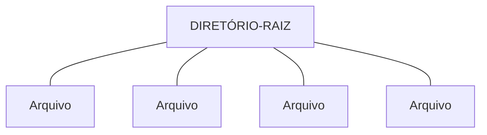
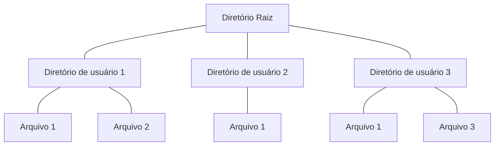

# Sistemas de arquivos
O sistema operacional também participa com todo o gerenciamento dos sistemas de arquivo

---
## CONTEXTUALIZAÇÃO
Vamos trabalhar com um cenário de uma microempresa do setor de alimentos que faz a distribuição de alimentos orgânicos para os supermercados da região Norte de páis.  
Em funçao das quedas frequentes de energia, o computador do gerente em um desses episódios, queimou.  
Todas as informações dos contratos que estavam centralizadas nesse computador e não tinham uma politica de backup bem estabelecida.  
Diante dessa situação, precisam recuperar a maior quantidade possivel de dados e informações do disco rígido.  
Porém, cientes de que essa não será uma tarefa fácil, precisarão além de estabelecer alguns critérios de processo de seurança da informação, recuperar e verificar a melhor forma de organizar esses arquivos e conseuir manipular e gerenciar essas informações sem preudicar o andamento dos projetos.

----
## Armazenamento da informação
Existem 3 requisitos essenciais para o armazenamento da informação a longo prazo:  

## Sistema de arquivos
Afinal, o que é um arquivo? Um arquivo é a maneira que o sistema operacional permite a leitura e gravação de **dados e arquivos**. Outra definição  é considerar o arquivo como um mecanismo de abstração, oferecendo meios de armazenamento de dados e permitindo a sua leitura posteriormente.    
Os sistemas de arquivos servem para facilitar a organização de arquivos sob o ponacom metadados, ou seja, que fazem referência ao dado, atribuindo características e especificando outras informações sobre o arquivo.  
O sistema de arquivos é um exemplo de parte vísivel do sistema operacional já que os usuários manipulam constantemente os arquivos.    
Organizar esses dados é de extrema importância para que haja o respectivo direcionamento no sistema computacional.  
Em função do tipo de processo que será acionado, outro fator importante é a **extensão dos arquivos**, pois, para cada uma, será realizado um procedimento de armazenamento de alocação de recursos distinto.

|Extensão|Significado|
|--------|-----------|
|Arquivo.txt|Arquivos de textos|
|Arquivos.zip|Arquivos comprimidos|
|Arquivo.jpg|Imagem codificada com o padrão JPEG|
|Arquivo.c|Programa fonte em C|
|Arquivo.bak|Arquivo de cópia de segurança|
|Arquivo.pdf|Arquivo no formato portátil de documentos|
|Arquivo.mpe|Música codificada de aúdio MPEG|

### Operações dos sistemas de arquivos
Para o sistema operacional, quando um arquivo precisa ser aberto, criado, fechado, enfim, qualquer uma das funções que o sistema de arquivos precisa desempenhar, temos de saber que a operação em andamento é compreendida pelo computador como um processo que deverá ser executado e direcionar o driver correto para que essa açao aconteça.  
- **Drive:** Conjunto de rotinas que devem ser executadas de acordo com o formato do arquivo.  
Precisamos configurar as permissões necessárias à execução de cada uma dessas ações.  

| Manipulação de arquivos | Manipulação de dados dos arquivos | Atributos de arquivos | Rotinas de entrada e saída de arquivos |
|----|---|----|-----|
|Abrir|Ler|Tamanho|CREATE|
|Fechar|Escrever|Localização|OPEN|
|Criar|Atualizar|Acessibilidade|READ|
|Destruir|Inserir|Tipo|WRITE|
|Copiar|Apagar|Volatilidade|CLOSE|
|Renomear|-|Atividade|Delete|
|Lista|-|Backup|-|

Segundo Tanenbaum (2003), sistemas de arquivos diferentes oferecem operações distintas para armazenar e recuperar informações. As principais operações são:  
- Create: Cria um arquivo sem dados e define alguns atributos;  
- Delete: Deleta um arquivo quando ele não é mais necessário, liberando espaço de memória.  
- - Open: Um processo deve abrir um arquivo antes de usá-lo, permitindo que o sistema busque e coloque na memória principal os atributos e alista de endereços do disco, agilizando o acesso as informações.  
- Close: Fecha um arquivo e libera espaço na memória
- Read: Leitura dos dados do arquivo    
- Write: Grava os dados no arquivo.  

### Arquivo e registros
**Arquivo** são unidades de armazenamento de dados mais abrangentes, que podem conter múltiplos registros ou outros tipos de informações organizados em uma estrutura lógica.  
**Registros** são estruturas de dados individuais dentros de um arquivo, contendo informações específicas ou campos de dados relacionados.  
Ou seja, um arquivo pode conter vários registros, enquanto um registro é uma unidade de dados dentro do arquivo.

### Organização de Arquivos
- Temos a **sequencial** também conhecida como **Não estruturada**, o aceso ao registro é precário pois é necessário a leitura de todos os registros até que seja encontrado o que de fato esta sendo procurado, pois a organização dos arquivos é feito sequencialmente.  
É a forma mais simples de organização, o arquivo sequencial indexado é formado por um arquivo sequencial e por um índice. Contém 3 áreas distintas: 
    - Área de índice  
    - Área de dados  
    - Área de extensão  
Aqui é efetuado a leitura dos registros de forma sequencial, comparando o "argumento de pesquisa" com o valor do registro até que se ache o que está sendo buscado.  
- Temos também a **indexada**, em que os dados se interligam através de um índice que a partir de sua definição organizará os dados de um registro de acordo com uma determinada regra. 
- É formada pela combinação de pelo menos um arquivo de dados e um ou mais arquivos de indice.   
Ex: No reistro a seguir em que os dados se interliam a partir de informações incomum com os demais. Essa ligação pode ser através de uma definição de idade, altura, sexo etc, que sejam compatíveis.  
É essencial que exista um dado em comum entra os registros do arquivo para que se obtenha tal indexação.  
- Temos também a **Relativa ou Direta**, refere-se a locação dinâmica e aleatória do arquivo. Pos esse motivo pode ser localizado a partir de uma chave de acesso e do local em que está armazenado.

### Nome do arquivo
Quando um processo cria um arquivo é atribuído a ele um nome, e quando o mesmo é encerrado, o arquivo continua existindo.
O nome do arquivo será limitado ao padrão e às regras estabelecidas pelo sistema de arquivos.  
A disponibilização dos possíveis nomes que os arquivos podem assumir, é conhecida como **espaços de nomes**.  
**DESTACADO**:  
- A função do sistema de arquivos é converter os nomes em locais onde esse arquivo está armazenado. Os nomes dos arquivos podem solicitar a ação de drivers de dispositivos de comunicação ou ainda que realizam a interface com outros processos. Os nomes podem fazer referência a dados já existentes ou que são gerados durante o processamento.  
**Os nomes dos arquivos solicitam ações**  
**Podem fazer referencia a dados já existentes**  
O sistema de arquivos identificará um arquivo a partir do seu nome, que é uma sequência de caracteres que podem conter letras maiúsculas, minúsculas, números etc, obedecendo a uma restrição de extensão e tipos de caracteres válidos.  
Além dessas características há também a possibilidade de um usuário determinar a forma hierárquica a organização dos seus arquivos, como se seuissem uma estrutura em árvore.

### Estrutura dos arquivos
Os arquivos podem ser estruturados de várias formas:  

- **Sequência estruturada de bytes:** (img a) O sistema operacional não sabe qual é o conteúdo do arquivo e tudo o que ele vê são *bytes*. Essa maneira oferece flexibilidade uma vez que os programas de usuários podem dar o nome que quiserem aos arquivos e inserir o conteúdo que quiserem.  
- **Sequência de registros de comprimento fixo:** (img b) O arquivo é uma sequência de registros de tamanho fixo, cada um com uma estrutura interna. O objetivo é que a operação de leitura retorne um registro e a operação de escrita sobreponha ou anexe um registro.  
1 registro = 1 bloco de dados de tamanho fixo e com uma certa estrutura interna.  
- **Árvore de registros:** (img c) Um arquivo é formado por uma árvore de registros, ou seja um arquivo vai ser um conjunto de registros organizados em árvores. **não necessariamente do mesmo tamanho, cada um contendo um campo-chave em uma posição fixa do registro. A árvore é ordenada por esse campo-chave para que se busque mais rapidamente. Novos registros podem ser inseridos no arquivo e é o S.O que decide onde colocá-los. Esse tipo é amplamente aplicao em computadores de grande porte, usados ainda para alguns processamentos de dados comerciais.   

### Tipos de Arquivos
Diferentes tipos de arquivos são suportados pelos sistemas operacionais.  Os **arquivos regulares** contém informações do usuário e são classificados como:  
- *Arquivos ASCII:* São formados por linhas de texto.A grande vantagem deste é que eles podem ser mostrados e impressos como são e podem ser editados com qualquer editor de texto, facilitando a conexão entre a saída de um programa e a entrada de outro.  
- *Arquivos binários:* Possuem alguma estrutura interna, conhecida pelos programas que os usam.  
  
Já os **arquivos de diretórios** mantem estrutura dos sistemas de arquivos.  
Enquanto os **arquivos especiais de caracteres** são relacionados a entrada/saída e usados para modelar dispositivos de E/S como terminais, impressoras, rede.  
Os **arquivos especiais de blocos** são usados para modelas discos.

### Acesso aos arquivos
Os arquivos podem recuperar informações de diferentes formas, de acordo com sua organização. Os primeiros sistemas operacionais armazenavam os arquivos em fitas magnéticas e seu **acesso era realizado de forma sequencial**. No acesso sequencial os arquivos são lidos sequencialmente a partir do inicio do arquivo, sempre na ordem em que os registros foram gravados.  
Com a criação dos discos magnéticos surgiu o **acesso direto** cuja leitura/gravação é feita na sua posição por meio do número do registro. Não existe restrições em relação a ordem em que os registros são lidos ou gravados, sendo sempre necessário especificar o número do registro. O **acesso direto** somente é possivel quando os registros do arquivo são de tamanho fixo, sendo que o mesmo pode ser combinado com o acesso sequencial sendo possível acessar qualquer registro de um arquivo e assim acessar os demais.  
O **acesso indexado ou por chave**, nele o arquivo deve possuir uma área de índice em que existam ponteiros para os diversos registros. A aplicação que desejar acessar o registro deverá especificar uma chave para que o sistema pesquise na área de índice o ponteiro correspondente, acessando o arquivo diretamente.

### Atributos dos arquivos
**Tamanho:** Especifica o tamanho a quantidade de caracteres ou bytes do arquivo.  
**Proteção:** Específica padrões de segurança de acesso aos arquivos.  
**Dono/Proprietário/Usuário:** Estabelece quem criou ou seja, associa o usuário a conta.  
**Criação:** Delimita data e hora da criação do arquivo para que a partir disso, facilite inclusive a busca e visualização por arquivo.  
**Backup:** Disponibiliza data e hora da última atualização.  
**OrGanização:** Indica qual é alógica e a hierarquia utilziada para armazenar os arquivos nos respectivos diretórios.  
Além das características de atributos de arquivos, precisamos compreender como é a estrutura dos diretórios.  
Existe a localização de arquivos em estruturas de diretórios de nível único e com dois níveis. 

### Espaço de nomes hierárquicos (Filesystem Hierarchy Standard)
O FHS (Padrão para Sistema de Arquivos), define os principais diretórios e o seu conteúdo em um sistema operacional.
|Diretório|Descrição|
|---------|---------|
| / |Diretório Raiz (root)de toda a hierarquia do sistema de arquivos|
|bin|Nessa pasta encontram se arquivos executáveis, que são necessários para a recuperação de dados e reparação de arquivos do sistema|
|etc|Arquivos de configuração de arquivos locais e softwares|
|home|Diretório de usuários, direta ou indiretamente. Nesse contexto necessita da administração local|
|usr| Diretório para dados compartilhados somemente no modo leitura|

### Solução do contexto
Podemos tentar utilziar o software **Minitool Partition Recovery** para restaurar os padrões deteriorados dos sistemas de arquivos.

## Sistemas de Diretórios
A estrutura de diretórios é como o sistema organiza logicamente os diversos arquivos contidos em um disco.  
O diretório é uma estrutura de dados que contém entradas associadas aos arquivos em que cada entrada armazena informações com localização física, nome, organização e demais atributos.  
Quando um arquivo é aberto o S.O procura sua entrada na estrutura de diretórios, armazenando as informações sobre atributos e localização do arquivo em uma tabela mantida na memória principal.  
**Essa tabela vai ficar mantida na minha memória principal**
Pois eu vou precisar trabalhar com os requisitos do meu sistema. Essa tabela contém todos os arquivos abertos, sendo fundamental para aumentar o desempenho das operações com arquivos.  
É importante que ao término do uso de arquivos esses sejam fechados, ou seja, que se libere o  espaço na tabela de arquivos abertos.

 
#### Sistemas de Diretórios: Nível único
Também conhecida como *single level directory*, tem muitas limitações. É uma forma simples de sistema de sistema de diretório, é manter um diretório contendo todos os arquivos, esse diretório será chamado de diretório raiz. Era utilizado nos primeiros computadores pessoais pois eles continham apenas um usuário. Por exemplo o usuário não pode criar arquivos com o mesmo nome para evitar conflitos de acesso, pois os arquivos recebem todas as características destacadas e são alocadas par armazenamento.  
Nessa todos os arquivos estão contidos no mesmo diretório.
Ex de estrutura de diretório em nivel único:

#### Sistemas de Diretórios Hierárquicos: Dois níveis e árvore de diretórios
Com o objetivo de evitar conflitos, foi percebido a importância de dar um diretório privado pra cada usuário. Assim os nomes escolhidos por um usuário não interfeririam nos nomes escolhidos pelo outro, podendo existir arquivos com o mesmo nome em dois ou mais diretórios.
O primeiro nível destina-se a divisão de contas de usuarios.  
O outro nível a alocação dos arquivos criados.  
Ele faz com que arquivos criados por contas de usuários distintos pudessem ter os mesmos nomes pois não estão alocados no mesmo diretório e não causam danos de integridade ou conflitos na localização e acesso aos arquivos.  
Nessa estrutura, o diretório aponta para a sua respectiva área de alocação de arquivos.  
Aqui cada usuario tem seu próprio *diretório de arquivos do usuário*.  
Esse esquema é chamado de diretório em dois niveis.

Dessa forma se faz necessário agrupar esses arquivos segundo as necessidades do usuário. Assim é necesário uma hierarquia geral, ou uma árvore de diretórios (folder tree).para permitir que os usuários tenham tantos diretórios quanto precisem para agrupar os seus arquivos.  
Essa estrutura facilita a organização dos arquivos opara o usuário que pode separar seus arquivos de acordo com suas necessiades, pois permite que ele cria diersos nívelsmde diretórios.

### Nomes de Caminhos dos diretórios
Quando o ssitema de arquivos é organizado por meio de uma árvore de diretórios, é necessário definir uma forma de especificar o nome dos arquivos. Para isso, são usados dois métodos: **nome de caminho absoluto** e **nome de caminho relativo**.  
- Nome de caminho absoluto: É formado pelo caminho entre o diretório-raiz e o arquivo. Os nomes de caminhos absolutos sempre iniciam no diretório-raiz e são unicos. Como exemplo o caminho:  
    /usuário/meus_documentos/atividades.txt  
Siginifica que dentro do diretório-raiz possui um diretório chamado "usuário" e dentro de "usuário" existe um subdiretório chamado "meus_documentos" e dentro do subdiretório "meus_documentos" existe um arquivo chamado "atividades.txt".  
- Nome de caminho relativo: É usado em conjunto com o conceito de diretório atual ou diretório de trabalho. Dessa forma é possível ser designado pelo usuário um diretório como diretório atual de trabalho em que todos os nomes de caminhos não comecem no diretório-raiz. Por exemplo se o diretório atual for /usuário/meus_documentos/, logo o arquivo cujo caminho absoluto for /usuário/meus_documentos/atividades pode ser referenciado apenas como atividades.

### Sistemas de diretórios do Linux
No linux o sistema de diretórios é baseado numa estrutura hierárquica e os diretórios são implementados por meio de arquivos. 
## Alocação de Arquivos
Alocação de arquivos é o método pelo qual os dados são apensados/incorporados/alocados no espaço de armazenamento físico no sistema operacional.

As estruturas de dados que podem ser usadas para essa alocação são basicamente listas e tabelas.  
### Alocação de Arquivos - Tabelas
A tabela de alocação é um mapa de utilização do disco ou disquete. Graças a ele, o S.O é capaz de saber exatamente onde um determinado ficheiro está armazenado.  
A forma mais simples de implementar uma estrutura de espaços livres é através de uma tabela chamada de **mapa de bits**(bit map).  
Cada linha da tabela é associdada a um bloco do HD e representado por um bit, que pode assumir um valor de 0(bloco livre) ou 1(bloco alocado).  
Os zeros (0) Representam os Espaços Livres em memória e (1) os espaços ocupados.  
A desvantantagem desse tipo é que ocupa muito espaço em memória.

### Alocação de Arquivos - Listas Encadeadas
O controle ocorre através dos blocos do disco que estão sem arquivos (livres).  
Cada bloco contém uma área que determina o endereço que deverá ser utilziado pelo próximo bloco.  
A partir do primeiro bloco disponível que for encontrado esse apontará para o endereço do próximo bloco disponível para realizar a alocação de dados e cria-se o conceito da **lista encadeada**.  
A partir do primeiro bloco pode-se ter acesso sequencial aos demais de forma encadeada.

## CONTEXTUALIZAÇÃO
Precisamos apresentar um mode de implementar um sistema de arquivos de rede, que seja compatível com os sitemas operacionais Windows, Unix e Linux.  
Para realizar essa tarefa, vocÊ precisa apresentar um modo de implementação de um sistema de arquivos de rede que esteja de acordo com as especificações de um dos fornecedores do sistema operacional e explicar o procedimento.

## Implementação de sistemas de arquivos
O sistema operacional precisa controlar quais as áreas ou bloos no disco estão livres quando um arquivo é criado.    
Envolve basicamente criar para cada arquivo o seu respectivo descritor.  
**Descritor de arquivos:** É um registro no qual são mantidas as informações a respeito do arquivo.  
Essas informações incluem os seus atributos, além de outros dados que não são visíveis aos usuários mas que são necessários para que o S.O implemente as operações sobre arquivos.  
Lembre-se que o descritor é acessado em todas as operações de leitura e escrita do arquivo.  
**Essas informações --> INCLUEM <-- os atributos mas elas são além disso**. Ou seja com apenas os atributos, não conseguimos implementar o sistema de arquivo, preciamos do descritor.  
Para tornar mais rápido o acesso aos arquivps, o sistema de arquivos mantém na memória uma tabela contendo toos os descritores dos arquivos em uso.  
Quando um arquivo entra em uso, o seu descritor é copiado do disco para a memória.  
Algumas formas de fazer essa implementação:  
### Alocação contígua
É o método mais simples, em que os arquivos são armazenados de forma sequencial no disco. Assim se você tem um disco rígido com blocos de tamanho 1MB e um arquivo cujo tamanho seja 40MB, você utilizará 40 blocos sequenciais de disco para alocar o arquivo, e assim por diante.  
Os dados são dispostos de maneira sequencial sobre  um conjunto de blocos consecutivos no disco, sem "buracos" entre os blocos. Assim a localização do conteúdo do arquivo no disco é definida pelo endereço do seu primeiro bloco.. O sistema localiza um arquivo através do endereço do primeiro bloco e da sua extensão em blocos.  

**##########IMAGEM PG 310**  

  
Por exemplo, caso um bloco do disco aresente defeito e não permita a leitura dos dados contidos nele, apenas o conteúdo daquele bloco é perdido. O conteúdo dos blocos anteriores e posteriores ainda poderão ser acessados.  
Porém por outro lado, uma das desvantagens é a sua baixa flexibilidade, pois o tamanho máximo de cada arquivo precosa ser conhecido no momento de sua criação. No exemplo acima por exemplo, o arquivo *relat.pdf* não pode ser aumentado de tamanho pois não há blocos livres imediatamente apóes ele. Para pode aumentar o tamanho desse arquivo ele teria de ser movido, ou o arquivo seguinte a ele (*instruc.txt*), para liberar os blocos necessários.

### Alocação por Lista Encadeada:
Consiste em organizar os mesmos como um conjunto de blocos ligados logicamente no disco, independete de sua localização física. Cada bloco contem um ponteiro para o bloco seguinte no arquivo.  

### Alocação por Lista Encadeada usando uma tabela na memória
Cada palavra de ponteiro de cada bloco de disco é inserida em uma tabela na memória principal, chamada de FAT (File Allocation Table)

### I-nodes
Cada arquivo é associado a uma estrutura chamada I-node (index-node), relacionando os atributos e os endereços em disco dos blocos de arquivos.

## Introdução à segurança e mecanismos de proteção

Os arquivos são compartilhados com usuários e utilizados para diversar finalidades.  
É necessário que o SO ofereça proteção desses arquivos para que usuários e processos que nao tenham permissão consigam acessá-los.  
Um sistema de arquivos possui diferentes mecanismos de proteção como:  
- Senha de acesso: Para ter acesso ao arquivo é necessário que o usuário a conheça e que o sistema conceda o acesso ao arquivo.  
- Grupo de usuários: Essa proteção consiste em associar cada usuário a um rupo para compartilhar arquivos.  
- Lista de controle de acesso (ACL): É uma lista associada a cada arquivo, com as permissões de cada usuário. Quando um usuário tenta acessar um arquivo o SO verifica sua permissão para autorizar ou não a operação realizada.

## RECAPITULAÇÃO:
- **Arquivos:** Atribuição de nomes, estrutura, tipos, acesso, atributos e operações  
- **Diretórios:** Diretório simples, sistemas de diretório hierárquico, nome de caminho e operações  
- **Introdução à implmentação do sistema de aquivos**, Virtualização do sistema de arquivos e registro  
- **Introdução à segurança e mecanismos de proteção**
