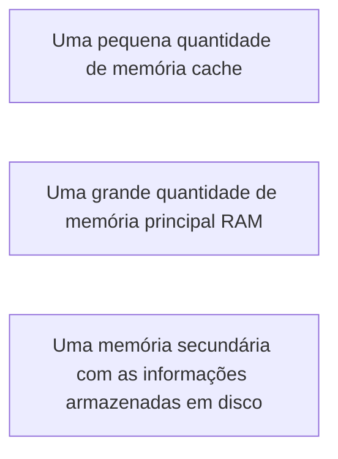

# Gerenciamento de Dispositivos
# Gerenciamento de memória
Memória é o lcoal de armazenamento de informações e o seu gerenciamento em um S.O é importante para garantir a eficiência das aplicações que rodam no computador.  
O conceito de hierarquia de memória, pode ser representado da seguinte maneira:  

A hierarquia de memória é controlada pelo **gerenciamento de memória**, responsável por gerenciar quais partes estão em uso e quais não estão, alocando-a quando os processos precisarem, liberando-a após o término dos processos e controlando a troca de processos entre a memória e o disco quando a memória principal não é suficiente para manter todos os processos em execução.

A hierarquia pode ser representada por uma pirâmide. Quanto mais alto as memórias estiverem, mais caras elas serão, ou seja, posuirão alta velocidade de processamento e baixa capacidade de armazenamento. E quanto mais baixa, mais baratas serão, ou seja, possuirão grande capacidade de armazenament e baixa velocidade de processamento.  
O gerenciamento de memória pode ser divido em duas classes:  
- Sistemas que fazem troca de processos e paginação.  
- Sistemas que não fazem troca de processos e paginação.  
A troca de processos (swapping) carrega todo o programa para a memoria princiap, o  executa por um determinado tempo e depois o retorna para o disco. A paginação divide a memória em partições para a execução das aplicações de forma eficiente.
## Troca de processos: SWAPPING
A troca de processos (swapping) é realizado quando não existe memória principal suficiente para executar todos os programas do computador o mesmo tempo.  
Na troca de processos um programa é totalmente carregado em memória e executado por um tempo definido, enquanto os demais programas aguardam, em disco, sua vez de executar.  
O swapping traz totalmente cada processo para a memória, o executa por algum tempo e o retorna para o disco. A figura presenta como se dá o funcionamento da troca de processos na memória principal.  

Exemplificando o conceito:  
- Um computador possui uma memória de 512MB e tem 4 processos para serem executados com os tamanhos de 481MB, 508MB, 380MB  e 369MB, respectivamente.  
- O gerencimanento de memória seleciona um processo inteiro para ser executado em memória e os demais processos aguardam em disco a sua vez de executar.  
- Se o primeiro processo (com o tamanho de 481MB) for selecionado para ser executado, ele é carregado para a memória e executado por um tempo determinado.  
- Assim que o tempo finalizar, o processo retorna para o disco e outro é selecionado para executar.  
- Importante: para a seleção do processo que será executado são utilizados algoritmos que utilizam de critérios para realizar a escolha.  
O swapping permite um maior compartilhamento da memória principal e utilização dos recuros do sistema..  
Porém quando existe pouca memória RAM disonível, o sistema pode ficar dedicado a execução do swapping, deixando de realizar as tarefas mais críticas, se tornando ineficiente.
## Paginação e tabela de páginas
A paginação é a técnica de gerência de memória em que o endereçamento virtual  o espaço de endereçamento real são dividios em blocos do mesmo tamanho, chamado páginas. Foi criada para fornecer um epaço de endereçamento linear sem a necessidade de adquirir mais memória física. 

 
Os programas geram endereços virtuais e constituem o espaço de endereçamento virtual. Nos sistemas operacionais que trabalham com a memória virtual, o endereçamento virtual é enviado par a a MMU (Memory management unit,em que um chip está localizado na CPU).  
A CPU gera os endereços virtuais e os envia a MMU. A MMU por sua vez envua os endereços físicos para  a memória.
  
O endereço virtual divide-se em unidades conhecidas como páginas e sua referência na memória física são as molduras de página. As páginas e as molduras de páginas tem o mesmo tamanho e a movimentação entre disco e memória são sempre realizadas em unidades de página.

Repare que na figura temos 16 páginas virtuais e 8 molduras de página. Quando um programa tenta acessar o endereço 0, o endereço virtual 0 é enviado a MMU, que o localiza na pégina virtual (0 a 4K) e que corresponde à moldura de página 2 (8K a 12K). A MMU transforma o endereço virtual 0 no endereço 8K e o envia a memória por meio do barramento, Como existem apenas oito molduras de página física, somente oito páginas virtuais podem ser mapeadas.  
O mapeamento realizado pela MMU dá-se por meio da tabela de páginas, O objetivo da tabela é mapear paginas virtuais em molduras de pagina física.  
A tabela de paginas contem o endereço virtual de cada moldura de pagina na mmoria fisica e o numero da página é utilizado como um índice na tabela. Cada processo possui sua tabela própria e cada página possui uma entrada nela.  
Cada pagina na tabela possui um bit presente/ausente. Se o bit foi 0 indica uma interrupção por falta de página e caso o bit tenha valor 1, a pagina esta mapeada na memória. O número da moldura deve ser concatenado com os bits dedeslocamento formando o endereço fisico. 
A figura a seguir apresenta um exemplo de como a MMU trabalha junro com a tabela de paginas: *(Operação interna da MMU com 16 paginas)*  

### Algoritmos de substituição de páginas
Quando uma falta de páginas ocorre, o sistema operacional precisa escolher uma a ser removida da memória, a fim de liberar espaço para uma nova ser trazida.  
Esse processo é feito pelos algritmos de substituição de páginas que têm o objetivo de selecionar as páginas com as menores chances de serem referenciadas (utilizadas) no futuro.  
Quanto menor for o tempo gasto comas recargs de páginas, mais eficientes será o algoritmo.  
Há vários algoritmos de substituição de páginas, como podemos observar.  
- Algoritmos de substituição de página ótimo  
- Algoritmo de substituição de página não recentemente utilizada NUR    
- Algoritmo de substituição de página FIFO  
- Algoritmo de substituição de páginas de segunda chance SC
- Algoritmo de substituição de página relógio  
- Algoritmo de ssubtituição de página menos recentemente utilizada MRU  

### Segmentação
Se um programa possui um número grande de variáveis, o espaço reservado para elas na tabela de simbolos pode se esgotar a medida que o compilador é executado e sobrara espaço nas outras tabelas.  
Para resolver este problema temos que fornecer ao computador vários espaços de endereçamento independentes chamados de segmentos.  
Cada segmento tem um tamanho dinâmico e independente dos outros (que varia de 0 a um valor máximo), conforme figura abaixo, permitindo que o segment aumente ou diminua durante a execução. Os endereçoes são compostos pelo numero do esgmento e um deslocamento dentro do segmento.  

## Monoprogramação sem troca de processos ou paginação
Esse mecanismo de gerenciamento é o mais simples, no qual somente um programa é executado por vez e a memória é compartilhada entre o sistema operacional e o programa. 
Consiste basicamente em  dividir a memória em dois compartimentos, um para ser usado pelo sistema operacional e outro par ao programa que deverá ser executado.  
Ela pode ocorrer em 3 formas:  
  
- a: O S.O está utilizando o espaço de endereçamento de RAM(memória principal) 
- b: O S.O está utilizando o espaço de endereçamento em ROM(tipo de memória que permite apenas leitura)  
- c: Os drivers de dispositivos estão em ROM e os programas do usuario e o S.O está em RAM

## Multiprogramação com partições fixas
Esse mecanismo está presenta na maioria dos sistmas operacionais modernos. Ele permite que vários processos executem ao mesmo tempo e quando um processo é bloqueado aguardando uma informação de entrada/saída, outro processo poderá utilizar a CPU.  
Aqui  memória é divida em *n* partições de tamanhos diferentes, podendo ser definida quando o sistema for iniciado. Quando um processo chega para ser executado, ele é inserido em uma fila associdada à menor partição suficiente para armzená-lo.  
A vantagem desse método é que podem existir muitos processos aguardando para serem executados em algumas partições e em outras filas não exista nenhum processo.  
  
Para solucionar o problema de espera na execução de um processo, podemos implementar uma fila única, assim um processo mais próximo do início da fila e que caiba na partição é carregada e executado. (**imagem: Partições fixas com filas únicas de entrada**)
  
Nas linguagens de programação o gerenciamento da memória é fundamental, pois a tendência das aplicações dos usuários é consumir cada vez mais a memória. Em muitas linguagens não é necessário se preocupar com o gerenciamento, porém é importante que seam conhecidas as restrições e capacidades do gerenciador de memória para uma programação eficaz.  

## Multiprogramação com partições variáveis
A alocação particionada variável consiste em ajustar dinamicamente o tamanho das partições de memória quando os processos chegam para serem executados. Ou seja, cada processo utiliza um espaço necessário para executar, não acontecendo a fragmentação interna.  
A vantagem das partições variáveis é a flexibilidade por não estar preso a um número fixo de partições, melhorando a utilização da memória, porém impactando o gerenciamento das trocas de processos e na alocação e liberação da memória. 
Quando processos precisam consumir mais memória durante o processamento, é necessário alocar memória dinamicamente. Existem dois métodos de gerencimento de memória com alocação dinâmica:  

## Fluxo de gerenciamento de recursos de memória e de processador
O gerenciamento de memória também conhecido como MMU(**Mmemory Management Unit**). Sua função é mapear os endereços lógicos em que estão as instruções nas memórias físicas.  
O acesso ao endereço lógicoque é gerado pelo processo e com isso a **MMU** direcionará o endereço lógico para o mesmo correspondente na memória física.

### Gerenciamento de memória com mapa de bits: 
  
Nesse método a memória é dividida em unidades de alocação, a qual é associada a um bit no mapa de bits. Se o valor do bit for 1, indica que a unidade está ocupada, e se o bit for 0, ela está livre.  
A imagem **(a)** acima mostra uma parte da memória com 5 segmentos alocados a processos (A,B,C,D e E) e 3 segmentos de memória livre (espaços vazios).
A imagem **(b)** mostra o mapa de bits correspondete a memória.  
Segmento é uma área de memória alocada a um processo ou uma área livre de memória entre dois processos.  
### Gerenciamento de memória com listas encadeadas

Aqui consiste em manter uma lista encadeada de segmentos alocados e livres na memória.  
A figura **(a)** mostra uma parte da memória cm cinco segmentos alocados a processos (A, B, C, D e E) e 3 segmentos de memória livre (espaços vazios). A figura **(c)** apresenta a lista encadeada e a memória dividida emuunidades de alocação.  
Cada elemento dessa lista especifica um segmento de memória disponível (H) ou de memória alocada ao processo (P), o endereço no qual se inici o segmento e um ponteiro para o próximo elemento  da lista.  
## Algoritmos de troca de processos
Para definir em qual área livre os processos serão executados por meio da lista encadeada são utilizados os algoritmos.   
- Fisrt Fit (O primeiro que couber): É o algoritmo mais simples e que consome menos recurso do sistema. O gerenciador de memória procura ao longo da lista por um segmento livre que seja suficientemente grande para esse processo.  
- Next Fit (O próximo que couber): Este algoritmo é uma variação do Fisrt Fit. A posição em que encontra o segmento de memória disponivel é memorizada não precisando percorrer toda lista quando se quer alocar.  
- Best Fit (Melhor que couber): Percorre toda a lista e escolhe o menor segmento de memória livre suficiente ao processo. Este algoritmo é mais lente uma vez que procura em toda a lista.  
- Worst Fit (Pior que couber): Sempre é escolhido o maior segmento de memória disponivel de maneira que , quando divididoo segmento disponível restante deve ser suficientemente grande para ser útil depois.  
- Quick Fit (Mais rápido que couber): Algoritmo rápido e mantém listas separadas por tamanhos de segmentos de memória mais solicitados disponível. 

## Alocação de memória
Há 3 tipos:  
- Alocação contígua simples: Mais voltada pra realidade dos primeiros S.O (mais antigos). Sendo a memória principal divida em 2 grandes áreas: uma para alocar o sistema operacional e outra para alocar as aplicações do usuário.  
Dessa fora o desenvolvimento dessas aplicações de usuário tinha que respeitar os limítes da área de alocação disponível pras aplicações de usuário predeterminadas.  
- Técnica de overlay: Considera que diante de uma aplicação, a divisão de módulos auxiliará na determinação do espaço de memória necessária a executar os módulos de forma independente.
- Divisão da aplicação em módulos
# Memória Virtual
A memória virtual é um espaço reservado no disco rígido do computador para ser utilizado quando a memória RAM não é suficiente para executar. 
## Memória RAM X Memória cache
### Memória RAM
A memória RAM é usada como espaço de armazenamento temporário do sistema como instruções ou outros dados ativamente usados pelo usuário. Ela é mais rápida.  
Ela é responsável pelas multitarefas do dispositivo, por exemplo, abrir um navegador enquanto joga com o Spotify aberto. Cada um desses programas exige um pouco do processador e com a ajuda da memória RAM, a CPU encontra as informaões de forma mais fluida.  
Então por exemplo, quando estamos com vários programas abertos no computaor, cada programa, vai aumentar o consumo de memória RAM, já que elas estão todas em execução simultaneamente.  
Afinal, o que nós usuários esperamos, e que se eu estou na janela do navegador, e alterno pra janela do Spotify, quero que o conteúdo dessa outra janela seja exibido assim que que eu clique.  
A memória RAM tambem tem um importante papel em renderização, pois enquanto o programa renderiza, parte da memória temporária é armazenada no RAM antes de ser transformada em um arquivo. Por isso quem trabalha com Render, tende a usar computadores com mais memória RAM. 
### Memória Cache
É usada pela CPU, que armazena dados frequentemente acessados e usa como bufer entre RAM e CPU. Ela é muito mais veloz para não interferir nesse buffer, porém tem um menor tamanho.  
O objetivo dela é armazenar informações regularmente acedidas pelo processador.
Ela é integrada diretamente no processador ou localizada e um chip próximo do processador. Sendo responsáveis por gramde aumento na velocidade de processamento.  

