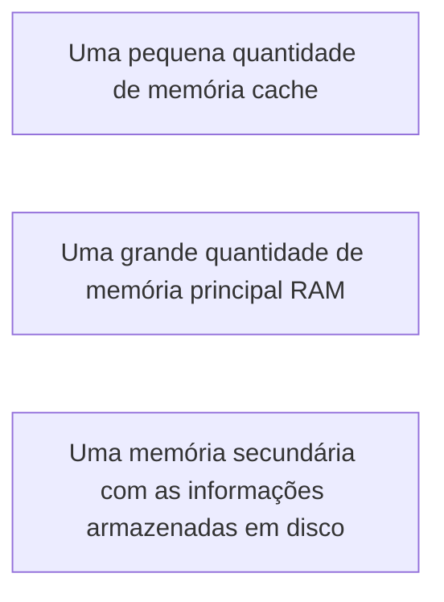

# Gerenciamento de Dispositivos
## Gerenciamento de memória
Memória é o lcoal de armazenamento de informações e o seu gerenciamento em um S.O é importante para garantir a eficiência das aplicações que rodam no computador.  
O conceito de hierarquia de memória, pode ser representado da seguinte maneira:  

A hierarquia de memória é controlada pelo **gerenciamento de memória**, responsável por gerenciar quais partes estão em uso e quais não estão, alocando-a quando os processos precisarem, liberando-a após o término dos processos e controlando a troca de processos entre a memória e o disco quando a memória principal não é suficiente para manter todos os processos em execução.

A hierarquia pode ser representada por uma pirâmide. Quanto mais alto as memórias estiverem, mais caras elas serão, ou seja, posuirão alta velocidade de processamento e baixa capacidade de armazenamento. E quanto mais baixa, mais baratas serão, ou seja, possuirão grande capacidade de armazenament e baixa velocidade de processamento.  
O gerenciamento de memória pode ser divido em duas classes:  
- Sistemas que fazem troca de processos e paginação.  
- Sistemas que não fazem troca de processos e paginação.  
### Monoprogramação sem troca de processos ou paginação
Esse mecanismo de gerenciamento é o mais simples, no qual somente um programa é executado por vez e a memória é compartilhada entre o sistema operacional e o programa.  
Ela pode ocorrer em 3 formas:  
  
- a: O S.O está utilizando o espaço de endereçamento de RAM(memória principal) 
- b: O S.O está utilizando o espaço de endereçamento em ROM(tipo de memória que permite apenas leitura)  
- c: Os drivers de dispositivos estão em ROM e os programas do usuario e o S.O está em RAM

### Multiprogramação com partições fixas
Esse mecanismo está presenta na maioria dos sistmas operacionais modernos. Ele permite que vários processos executem ao mesmo tempo e quando um processo é bloqueado aguardando uma informação de entrada/saída, outro processo poderá utilizar a CPU.  
Aqui  memória é divida em *n* partições de tamanhos diferentes, podendo ser definida quando o sistema for iniciado. Quando um processo chega para ser executado, ele é inserido em uma fila associdada à menor partição suficiente para armzená-lo.  
A vantagem desse método é que podem existir muitos processos aguardando para serem executados em algumas partições e em outras filas não exista nenhum processo.  
  
Para solucionar o problema de espera na execução de um processo, podemos implementar uma fila única, assim um processo mais próximo do início da fila e que caiba na partição é carregada e executado. (**imagem: Partições fixas com filas únicas de entrada**)
  
Nas linguagens de programação o gerenciamento da memória é fundamental, pois a tendência das aplicações dos usuários é consumir cada vez mais a memória. Em muitas linguagens não é necessário se preocupar com o gerenciamento, porém é importante que seam conhecidas as restrições e capacidades do gerenciador de memória para uma programação eficaz.  

## Fluxo de gerenciamento de recursos de meória e de processador
O gerenciamento de memória também conhecido como MMU(**Mmemory Management Unit**). Sua função é mapear os endereços lógicos em que estão as instruções nas memórias físicas.  
O acesso ao endereço lógicoque é gerado pelo processo e com isso a **MMU** direcionará o endereço lógico para o mesmo correspondente na memória física.

## Alocação de memória
Há 3 tipos:  
- Alocação contígua simples: Mais voltada pra realidade dos primeiros S.O (mais antigos). Sendo a memória principal divida em 2 grandes áreas: uma para alocar o sistema operacional e outra para alocar as aplicações do usuário.  
Dessa fora o desenvolvimento dessas aplicações de usuário tinha que respeitar os limítes da área de alocação disponível pras aplicações de usuário predeterminadas.  
- Técnica de overlay: Considera que diante de uma aplicação, a divisão de módulos auxiliará na determinação do espaço de memória necessária a executar os módulos de forma independente.
- Divisão da aplicação em módulos

## Gerenciamento de memória
Pode ser dividio em duas classes:
- Sistemas que durante o processamento levam e trazem informações da memória para o disco (troca de processos e paginação)  
- Sistemas que não o fazem. A troca de processos (swapping) carrega todo o programa para a memória principal, o executar por um determinado tempo e depois o mesmo retorna para o disco. A paginação divide a memória em partições para a execução das aplicações.
### Monoprogramação sem troca de processos ou paginação
Esse método de gerenciamento de memória, é o mais simples pois somente um programa é executado por vez, a memória é compartilhada entre o sistema operacional o programa. Temos 3 formas em que pode ocorrer esse tipo: 
- O sistema operacional está utilizando o espaço de um endereçamento em RAM.  
- O sistema operacional está utilizando espaço de endereçamento em ROM somente para a leitura.  
- Os drivers de dispositivos estão em ROM e os programas do usuario e o S.O estão em RAM.